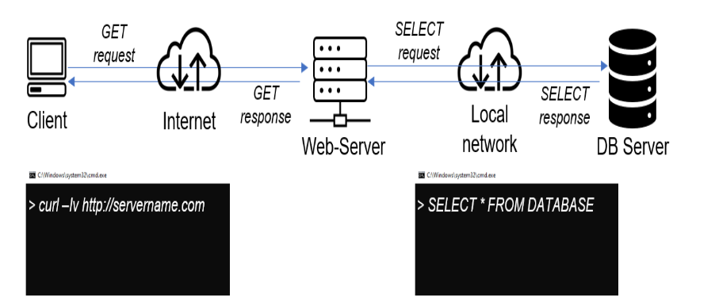

# UNDERSTANDNG CLIENT-SERVER ARCHITECTURE WITH MYSQL AS RDBMS

open **propitixhomes.com** on the Linux console using the code 

`$ curl -Iv www.propitixhomes.com
`

in this instance, I will run two EC2 servers

named 

Server A name - `mysql server 1`

Server B name - `mysql client 1`

I installed MySQL Server software On MySQL server 1. using the code below to both update and install the MySQL server.

`sudo apt install mysql-server -y`

I activated my MySQL server using the code below 

`sudo systemctl enable mysql`

next, I installed MySQL client software on my client server using the code below

`sudo apt install mysql-client -y`

to know my private IP address of MySQL client server I used the code below

`ip addr show`

afterward, I added the IP address of the client on my inbound allowed source of traffic on the EC2 instance

afterward, I created a database on the server

I changed the bind address on the MySQL-server to allow connection from any IP address, and I set the bind address to `0.0.0.0` using the commnd below

`sudo vi /etc/mysql/mysql.conf.d/mysqld.cnf 
`

after which I restarted MySQL database

thereafter I connected to the server database through the client side using the code below

`sudo mysql -u remote_user -h 172.31.41.164 -p` 

**172.31.41.164**  - is the database server's private IP address 

